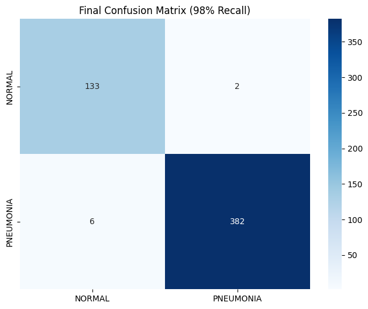
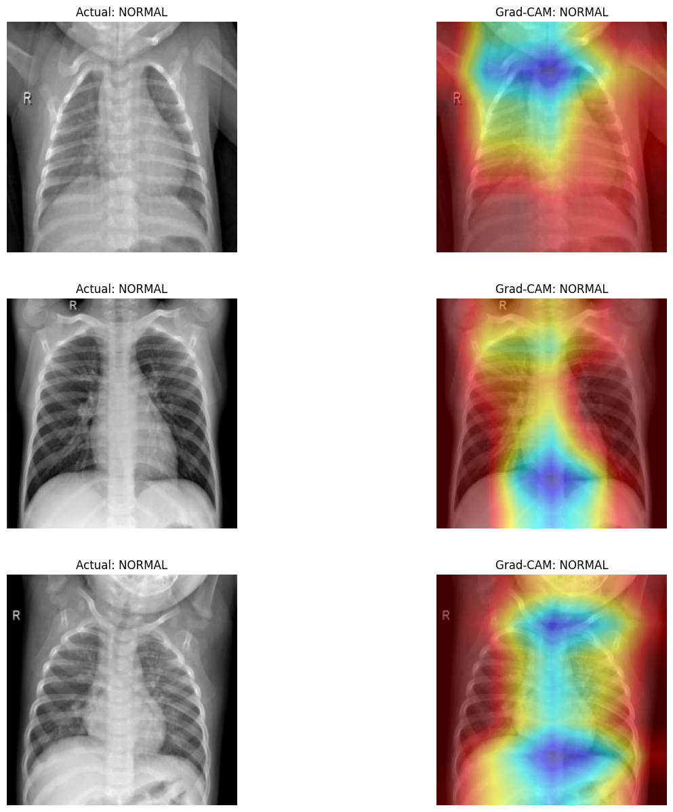
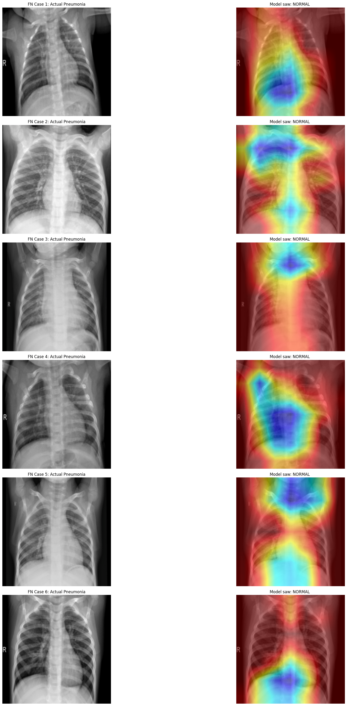

# Explainable Pneumonia Detection via ResNet-18 & Grad-CAM

## 📋 Project Overview
This repository contains a high-sensitivity Deep Learning pipeline designed to diagnose Pneumonia from Chest X-rays. Moving beyond standard classification, this project prioritizes **Explainable AI (XAI)**. By implementing **Grad-CAM (Gradient-weighted Class Activation Mapping)**, the model provides visual proof of its decision-making process, ensuring that predictions are driven by actual pulmonary pathology rather than background noise.

The primary engineering directive was to maximize **Recall (Sensitivity)** to minimize dangerous False Negatives, while maintaining strict diagnostic precision for normal cases.

---

## 🚀 Key Performance Metrics

Through sequential fine-tuning, the model's performance was optimized from a baseline of 93% recall (26 False Negatives) to a highly reliable clinical standard, reducing missed diagnoses by 77%.

* **Pneumonia Recall:** **98%** (Only 6 missed cases out of 388)
* **Specificity (Normal):** **99%** * **Overall Accuracy:** **98%**
* **F1-Score:** **0.99**

### Clinical Validation (Confusion Matrix)
*The matrix below visualizes the model's high sensitivity on the unseen test set of 523 images.*

 

---

## 🛠️ Technical Implementation & Architecture

* **Backbone Architecture:** ResNet-18 (Pre-trained on ImageNet).
* **Optimization Strategy:** * **Phase 1 (Warm-up):** Trained the custom classification head with a frozen feature extractor to stabilize gradients.
    * **Phase 2 (Precision Fine-Tuning):** Unfroze the entire network. Applied a differential learning rate of $1 \times 10^{-5}$ using an Adam optimizer and StepLR scheduler. This micro-adjustment prevented catastrophic forgetting while allowing the model to hyper-specialize in radiographic textures.
* **Loss Function:** CrossEntropyLoss.

---

## 🔍 Explainability (XAI) with Grad-CAM

To build trust in the automated diagnostic process, custom PyTorch forward and backward hooks were attached to the final convolutional layer (`layer4`) of the ResNet-18 backbone. 

**Visual Verification:** The heatmaps below confirm the model correctly distributes its attention across clear lung parenchyma for "Normal" predictions, and sharply focuses on dense pulmonary opacities for "Pneumonia" predictions.



---

## 🕵️ Deep Failure Analysis (Edge Case Study)

Robust engineering requires understanding system limitations. An Edge Case Study was conducted on the **6 remaining False Negatives** to document failure modes and guide future iterations.

**Key Findings:**
1.  **Anatomical Distraction:** In specific edge cases, the model's attention was drawn away from the lung fields by dense normal anatomy, such as the lower mediastinum or the intersection of the heart shadow and the diaphragm.
2.  **Implication:** The model occasionally confuses extreme structural density with pathological opacities. 



---

## 💻 Quick Start: Inference Engine

### 1. Download the Model Weights
Download the pre-trained weights (`pneumonia_final_best.pth`) from the [Releases tab](https://github.com/Sarang1712/Explainable-Pneumonia-Detection/releases/tag/v1.0) of this repository and place them in the `model/` directory.

### 2. Install Dependencies
```bash
pip install -r requirements.txt
```

### 2. Run Diagnostics
```bash
python inference_engine.py --image_path sample_xray.jpeg --model_path model/pneumonia_final_best.pth
```

---

## 🔮 Future Scope & Deployment Optimization

* **Edge AI & TinyML Deployment:** The current ResNet-18 architecture is lightweight enough to be optimized for embedded systems. Future work involves applying Post-Training Quantization (PTQ) to convert weights to INT8, enabling energy-aware, offline inference directly on hardware accelerators.
* **Architecture Evolution:** Exploring Vision Transformers (ViT) to better capture global anatomical context and reduce the localized distractions observed in the edge case study.
